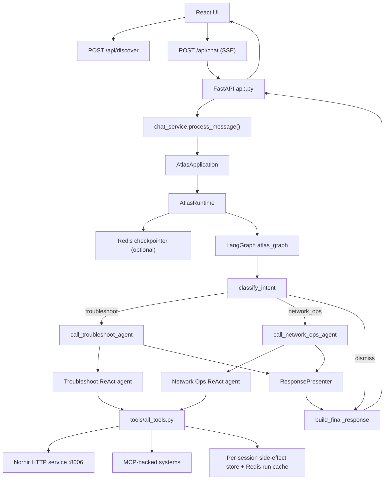

# Atlas

Atlas is an AI-assisted network operations application with two primary workflows:

- **Troubleshooting** for live investigations such as connectivity, performance, and intermittent issues
- **Network operations** for operational actions such as ServiceNow incident/change work and firewall or policy review

The current architecture is built around a small LangGraph router, two specialized ReAct agents, a centralized tool layer, and a separate Nornir HTTP service for live network collection.

## What Atlas Does

Atlas currently supports work in these broad categories:

- **Connectivity troubleshooting**
  - live forward and reverse path tracing
  - route and interface inspection
  - interface counter collection
  - routing-history correlation
  - ServiceNow correlation
  - deterministic structured response payloads for path visuals and counters
- **Performance and intermittent troubleshooting**
  - live diagnostics plus selective long-term memory recall when live evidence suggests history is relevant
- **Network operations**
  - create and retrieve ServiceNow incidents
  - create, update, close, and retrieve ServiceNow change requests
  - policy checks
  - controlled path lookups for operational context

## Architecture Overview

Atlas now has clear owners for the main application responsibilities:

- [`atlas_application.py`](<atlas_application.py>)
  - top-level application owner
- [`services/graph_runtime.py`](<services/graph_runtime.py>)
  - graph execution owner
- [`agents/agent_factory.py`](<agents/agent_factory.py>)
  - agent construction owner
- [`services/response_presenter.py`](<services/response_presenter.py>)
  - final response payload owner
- [`services/memory_manager.py`](<services/memory_manager.py>)
  - pending-context and recall-policy owner
- [`tools/tool_registry.py`](<tools/tool_registry.py>)
  - tool-set owner

### Request Flow



### Layer Boundaries

- **Frontend**
  - sends the query
  - renders the SSE status timeline
  - renders structured payloads such as path visuals and interface counters
- **FastAPI**
  - authentication
  - SSE lifecycle
  - chat-history persistence
  - cache flush after write operations
- **Chat entrypoint**
  - `chat_service.py` is intentionally thin
  - delegates to `AtlasApplication`
- **Application/runtime**
  - `AtlasApplication` owns the top-level processing flow
  - `AtlasRuntime` owns graph invocation, initial state, config, and final-response extraction
- **Graph**
  - coarse routing only: `troubleshoot`, `network_ops`, `dismiss`
- **Agents**
  - pure specialized ReAct agents with minimal wrappers
- **Tools**
  - the only layer allowed to interact with backends
  - return human-readable tool output plus structured side effects
- **Presenter**
  - converts session/tool state into the UI-facing payload

## Core Modules

### Entry and runtime

- [`app.py`](<app.py>)
  - FastAPI routes, SSE streaming, chat persistence, built-frontend serving
- [`run_web.py`](<run_web.py>)
  - recommended development launcher for the web app
- `chat_service.py`
  - thin entrypoint from HTTP into the application
- [`atlas_application.py`](<atlas_application.py>)
  - application owner that wires runtime, memory, presenter, tools, and agents
- [`services/graph_runtime.py`](<services/graph_runtime.py>)
  - graph execution owner
- [`services/checkpointer_runtime.py`](<services/checkpointer_runtime.py>)
  - Redis-backed LangGraph checkpointer lifecycle

### Graph

- [`graph_builder.py`](<graph_builder.py>)
  - graph structure
- [`graph_nodes.py`](<graph_nodes.py>)
  - routing node, troubleshoot node, network-ops node, final response node
- [`graph_state.py`](<graph_state.py>)
  - typed graph state

### Agents

- [`agents/agent_factory.py`](<agents/agent_factory.py>)
  - minimal shared ReAct agent factory
- [`agents/troubleshoot_agent.py`](<agents/troubleshoot_agent.py>)
  - troubleshooting agent builder
- [`agents/network_ops_agent.py`](<agents/network_ops_agent.py>)
  - network-ops agent builder

### Services

- [`services/memory_manager.py`](<services/memory_manager.py>)
  - pending clarification state and evidence-driven recall signals
- [`services/request_preprocessor.py`](<services/request_preprocessor.py>)
  - incident expansion, IP/port extraction, clarification helpers
- [`services/response_presenter.py`](<services/response_presenter.py>)
  - deterministic payload shaping for troubleshoot and network-ops answers
- [`services/runtime_helpers.py`](<services/runtime_helpers.py>)
  - session-data merge, snapshot/path completeness checks, status push helpers

### Tools and external integrations

- [`tools/all_tools.py`](<tools/all_tools.py>)
  - centralized tool implementations
- [`tools/tool_registry.py`](<tools/tool_registry.py>)
  - tool-set ownership
- [`mcp_client.py`](<mcp_client.py>)
  - MCP calls for systems such as ServiceNow
- [`nornir/server.py`](<nornir/server.py>)
  - live network collection service on port `8006`

### Frontend

- [`frontend/src/stores/chatStore.js`](<frontend/src/stores/chatStore.js>)
  - chat lifecycle and status timeline
- [`frontend/src/utils/api.js`](<frontend/src/utils/api.js>)
  - `/api/discover` and `/api/chat` helpers
- [`frontend/src/components/messages/AssistantMessage.jsx`](<frontend/src/components/messages/AssistantMessage.jsx>)
  - payload-driven assistant rendering
- [`frontend/src/components/path/PathVisualization.jsx`](<frontend/src/components/path/PathVisualization.jsx>)
  - forward and reverse path diagrams

## Intent Routing

Atlas uses **coarse routing** in [`graph_nodes.py`](<graph_nodes.py>) `classify_intent(...)`.

This routing is intentionally simple and deterministic:

- `troubleshoot`
  - live investigations
  - connectivity, routing, OSPF, reachability, packet loss, latency
- `network_ops`
  - incidents
  - change requests
  - policy review
  - firewall/path review workflows
- `dismiss`
  - acknowledgements or unsupported requests

Once Atlas chooses the agent, the **LLM** decides which tools to use inside that agent.

That means:

- regex decides **which agent**
- the ReAct agent decides **which tools**

## Tool Model

Every tool in [`tools/all_tools.py`](<tools/all_tools.py>) follows the same model:

- accept typed arguments the LLM can fill
- accept hidden runtime config for `session_id`
- optionally push status updates
- write structured side effects into the per-session store
- return a human-readable string for the LLM

### Tool sets

- `ALL_TOOLS`
  - full troubleshooting surface
- `CONNECTIVITY_TOOLS`
  - restricted set for the connectivity scenario
  - deliberately excludes `recall_similar_cases(...)`
- `NETWORK_OPS_TOOLS`
  - restricted ops surface
  - includes ServiceNow creation/update/detail tools
  - may use `trace_path(...)` for CI selection

## State and Memory

Atlas uses three distinct state layers:

### 1. LangGraph conversation state

- owned by `AtlasRuntime`
- optionally persisted to Redis through `AsyncRedisSaver`
- keyed by browser `session_id` as LangGraph `thread_id`

### 2. Per-session tool side-effect store

Stored inside [`tools/all_tools.py`](<tools/all_tools.py>) and cleared between runs.

Examples:

- `path_hops`
- `reverse_path_hops`
- `interface_counters`
- `routing_history`
- `connectivity_snapshot`
- `servicenow_summary`

### 3. Run-scoped Redis cache

Also used in `all_tools.py` for read-only backend results during a run:

- route lookups
- find-device lookups
- owner maps

This cache is scoped to the session/run and explicitly cleared.

### 4. MemoryManager responsibilities

[`services/memory_manager.py`](<services/memory_manager.py>) owns:

- pending clarification state
- recall-signal evaluation
- long-term memory store hook

Long-term recall is no longer always-on background context. It is gated by evidence signals such as:

- path anomalies
- interface failures
- service reachability failures
- unresolved connectivity findings

## Response Shaping

Atlas does not let the LLM freely shape every UI payload.

[`services/response_presenter.py`](<services/response_presenter.py>) owns:

- deterministic `ServiceNow` section replacement
- interface counter grouping
- network-ops path visibility rules
- fail-closed troubleshoot output when live evidence is unavailable

That means the final payload can safely contain:

- `direct_answer`
- `path_hops`
- `reverse_path_hops`
- `interface_counters`
- `connectivity_snapshot`
- `incident_summary`

without depending on the LLM to keep those structures consistent.

## Running Atlas

### Prerequisites

- Python environment in `.venv`
- Node.js for the frontend
- Ollama reachable at the configured `OLLAMA_BASE_URL`
- Redis recommended for LangGraph persistence and run cache
- ServiceNow / other backend credentials as needed

### Backend web app

Recommended development launcher:

```bash
cd /Users/manig/Documents/coding/atlas
.venv/bin/python run_web.py
```

This starts the FastAPI app on port `8001` with reload enabled.

### Nornir live network service

```bash
cd /Users/manig/Documents/coding/atlas
.venv/bin/python nornir/server.py
```

This starts the Nornir HTTP service on port `8006`.

### Frontend development server

```bash
cd frontend
npm install
npm run dev
```

Vite serves the frontend on port `5173`.

### Frontend production build

```bash
cd frontend
npm run build
```

FastAPI serves the built app automatically from `frontend/dist` when it exists.

## Key HTTP Endpoints

- `POST /api/discover`
  - lightweight preflight label for the UI
  - currently returns a neutral `Atlas` label
- `POST /api/chat`
  - SSE chat stream
  - emits `status` events and one `done` event
- `GET /api/chat/history`
- `GET /api/chat/conversations`
- `GET /api/chat/conversations/{conversation_id}`

## Troubleshooting the Application

See:

- [`Documentation/General/troubleshooting/troubleshooting.md`](<Documentation/General/troubleshooting/troubleshooting.md>)
- [`Documentation/End-to-End-flow/troubleshooting-query-flow.md`](<Documentation/End-to-End-flow/troubleshooting-query-flow.md>)
